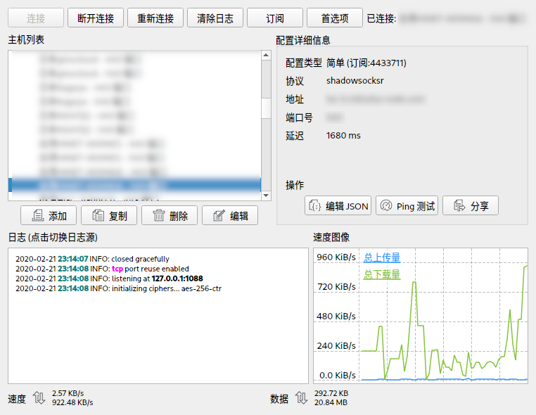

# qvssr

A cross-platform V2ray/SS(R) client written in qt.


-------------------------------

## How to build
For arch users
````bash
yay -S hicolor-icon-theme qt5-base grpc git gcc make qt5-tools \
       qt5-declarative grpc-cli
git clone https://github.com/DuckVador/qvssr.git
cd qvssr
git submodule init
git config submodule."libs/libqvb".active false
git submodule update
mkdir -p build && cd build
qmake PREFIX=/usr ../
make
````


## Project Motivation

I have suffered electron-ssr poor performance for a long time which is based on electron and python. It runs fine on a desktop, but it has a high memory usage and poor performance on my chromebook.  I have no choice but to write one.

## To be improved

- [x] socks5 proxy mode for ssr.
- [x] ssr subscription.
- [x] switch v2ray and ssr easily.
- [ ] http server mode for ssr.
- [ ] pac proxy mode for ssr.
- [ ] manual config for ssr. Currently we only support subscription for now.

## Licence

Shadowsocks-deepin is under [GPLv3](LICENSE) licence.

Appreciation to the following open source projects:

- [qv2ray](https://github.com/Qv2ray/Qv2ray)
- [shadowsocks-libev](https://github.com/shadowsocks/shadowsocks-libev)
- [shadowsocksr-libev](https://web.archive.org/web/20170207153230/https://breakwa11.github.io/)

## Dependencies

| Name                   | License        |
| ---------------------- | -------------- |
| [X2Struct](https://github.com/xyz347/x2struct)   | Apache|
| [QJsonModel](https://github.com/dridk/QJsonModel) | MIT|
| [QZxing](https://github.com/ftylitak/qzxing) | Apache2|
| [ScreenShot](https://github.com/Singein/ScreenShot)                  | MIT |
| [QHttpServer](https://github.com/nikhilm/qhttpserver) | MIT|
| [SingleApplication](https://github.com/itay-grudev/SingleApplication) | MIT|
| [QHttpServer](https://github.com/nikhilm/qhttpserver) | MIT|
| [QNodeEditor](https://github.com/paceholder/nodeeditor) | BSD-3-Clause|
| [QvRPCBridge](https://github.com/Qv2ray/QvRPCBridge)                   | WTFPL       |
| [speedplotview](https://github.com/qbittorrent/qBittorrent)            | GPLv2       |
| [Qv2ray](https://github.com/Qv2ray/Qv2ray)            | GPLv3       |


